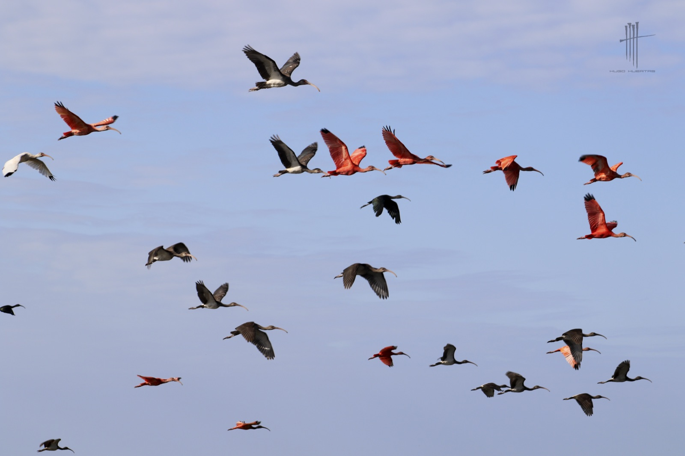
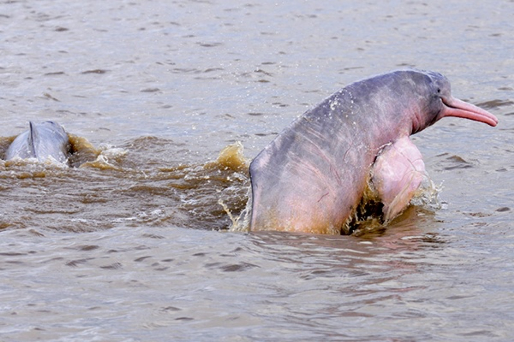
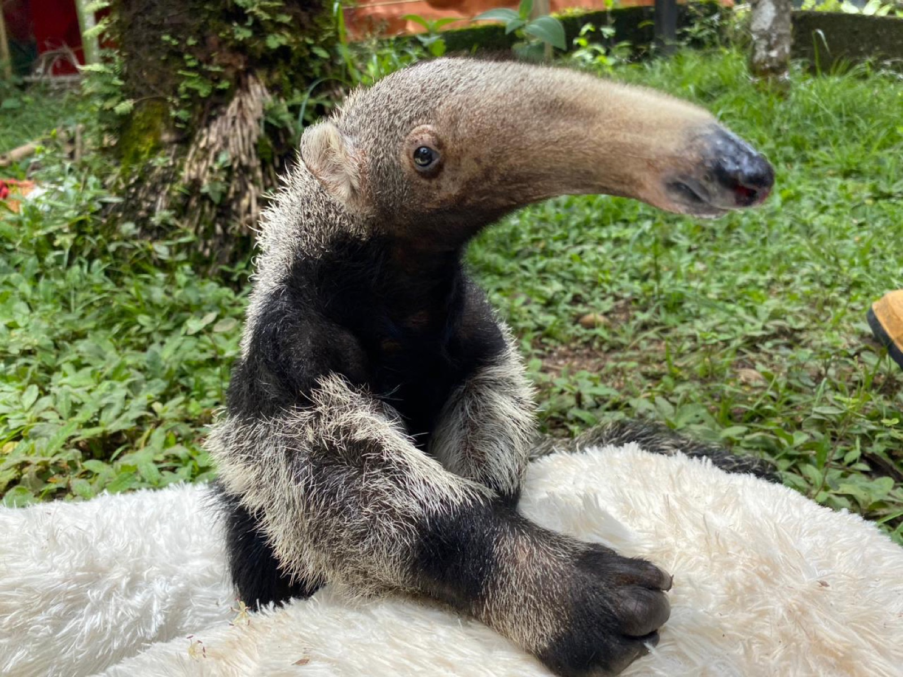

<div align="center">
  

  <h1>Pomodoro Llanero</h1>
  <p><strong>Concéntrate al ritmo de la sabana: un temporizador Pomodoro de escritorio que premia cada descanso con la fauna del Llano colombiano.</strong></p>

  
  
  
  
  

</div>

---

## 📋 Tabla de Contenidos

- [¿Qué es este proyecto?](#-qué-es-pomodoro-llanero)
- [Demo en vivo](#-demo-en-vivo)
- [Características principales](#-características-principales)
- [Capturas de pantalla](#-capturas-de-pantalla)
- [Instalación rápida](#-instalación-rápida)
- [Cómo usar](#-cómo-usar)
- [Arquitectura](#-arquitectura)
- [Roadmap](#-roadmap)
- [Contribuir](#-contribuir)
- [Licencia](#-licencia)

---

## 🎯 ¿Qué es Pomodoro Llanero?

**Pomodoro Llanero** es una app de escritorio para concentrarte por bloques de tiempo (la técnica Pomodoro) que convierte cada descanso en un pequeño respiro de naturaleza: aparece un animal distinto del Llano colombiano —la Orinoquía— con su nombre, su nombre científico y un dato curioso. Funciona **100% sin internet** y **sin recoger un solo dato tuyo**.

### El problema que resuelve

Las apps de productividad suelen romper tu concentración en lugar de protegerla: notificaciones, cuentas, sincronización en la nube y descansos que terminan en un scroll infinito de redes sociales que te roba más tiempo del que querías.

### La solución

Un temporizador **preciso, privado y sereno**. El descanso no te lanza a otra pantalla adictiva: te muestra un chigüiro, una corocora o una tonina del Llano, te cuenta algo sobre ella y te devuelve, descansado, a la siguiente faena.

### ¿Para quién es?

| Audiencia | Beneficio clave |
|-----------|----------------|
| 👩‍💻 **Profesionales y estudiantes** | Bloques de foco a prueba de distracciones, con descansos que reparan en vez de enganchar |
| 🌿 **Amantes de la naturaleza y la Orinoquía** | Una dosis diaria de fauna y cultura llanera mientras trabajan |
| 🔒 **Personas celosas de su privacidad** | Cero telemetría, cero cuentas, cero nube: todo vive en tu equipo |

---

## 🎬 Demo en vivo

<!-- TODO: grabar un GIF corto (10–15 s) del flujo principal: iniciar faena → fin de faena → aparece la fauna en el descanso → volver a la faena. -->
<!-- Guardarlo en docs/media/demo.gif y reemplazar el bloque de abajo por:
<div align="center">
  
  <p><em>De la faena al descanso: la fauna del Llano aparece como recompensa.</em></p>
</div>
-->

> 🎥 **Demo en preparación.** Mientras tanto, puedes probar la versión web (sin shell nativo) clonando el repo y ejecutando `npm run dev`, o descargar el instalador desde [Releases](https://github.com/castellanosfelipe/Pomodoro_llanero/releases).

---

## ✨ Características principales

| Feature | Descripción |
|---------|-------------|
| 🎯 **Temporizador de precisión** | Motor basado en **reloj monotónico** (no en `setInterval`): sobrevive a suspender/reactivar el equipo y al segundo plano sin acumular desfase |
| 🦫 **Fauna del Llano** | En cada descanso aparece un animal distinto —**sin repetir** hasta agotar el set de 22 especies— con nombre común, científico y un dato curioso |
| 🔒 **Local-first y privado** | Funciona sin conexión, sin cuentas y **sin telemetría**. Tus datos nunca salen de tu equipo |
| 🌅 **Identidad llanera viva** | La interfaz respira con el día (amanecer, mediodía, ocaso, noche), con vocabulario propio —*faena*, *descanso*, *siesta llanera*— y fauna ilustrada |
| ⚙️ **Totalmente configurable** | Duraciones, ciclos, auto-inicio, modo estricto, tema, idioma (ES/EN), bandeja del sistema, inicio con el equipo y atajos de teclado |
| 📊 **Estadísticas y rachas** | Faenas completadas, tiempo de foco, rachas y cumplimiento de meta diaria, con vista diaria y semanal |

---

## 📸 Capturas de pantalla

<!-- TODO: añadir capturas reales de la UI. Sugerencia de tomas (guardar en docs/media/): -->
<!-- 1. timer.png       → pantalla principal de la faena (horizonte cielo/tierra) -->
<!-- 2. break.png       → descanso con la fauna del Llano y su dato curioso -->
<!-- 3. settings.png    → panel de ajustes -->
<!-- 4. stats.png       → estadísticas y rachas -->
<!-- Reemplazar el showcase de abajo por bloques  -->

> 🖼️ **Capturas de la app en camino.** Por ahora, este es un vistazo a **la recompensa**: parte de la galería de fauna real incluida en la app.

### La recompensa: fauna del Llano

<div align="center">
  
  
  
  <br/>
  
  
  
  <p><em>Cada descanso muestra una especie distinta con su nombre y un dato curioso.</em></p>
</div>

---

## 🚀 Instalación rápida

### Opción A — Usuario final (recomendada)

1. Ve a la página de **[Releases](https://github.com/castellanosfelipe/Pomodoro_llanero/releases)**.
2. Descarga el instalador para tu sistema:
   - **macOS Apple Silicon (M1–M4):** `..._aarch64.dmg`
   - **macOS Intel:** `..._x64.dmg`
   - **Windows 10/11:** `..._x64-setup.exe` o `..._x64_en-US.msi`
3. Instala y abre la app.

> 🍏 **macOS — primera apertura.** La app aún no está firmada con Apple, así que macOS puede mostrar *"está dañada / desarrollador no identificado"*. Para autorizarla una sola vez:
> ```bash
> xattr -cr "/Applications/Pomodoro Llanero.app" && open "/Applications/Pomodoro Llanero.app"
> ```

### Opción B — Desde el código fuente

#### Prerrequisitos

- **Node.js** ≥ 18 y npm
- **Rust** (toolchain estable) — solo para compilar la app nativa → <https://www.rust-lang.org/tools/install>
- Dependencias de sistema de Tauri → <https://v2.tauri.app/start/prerequisites/>

#### Pasos

```bash
# 1. Clonar el repositorio
git clone https://github.com/castellanosfelipe/Pomodoro_llanero.git
cd Pomodoro_llanero

# 2. Instalar dependencias
npm install

# 3a. Ejecutar la app de escritorio NATIVA (requiere Rust)
npm run tauri:dev

# 3b. O iterar solo la UI en el navegador (sin shell nativo)
npm run dev
```

✅ Con `npm run tauri:dev` se abre la ventana nativa de **Pomodoro Llanero** listo para tu primera faena.

> No hay variables de entorno ni archivo `.env` que configurar: la app es local-first y funciona desde el primer arranque.

---

## 💡 Cómo usar

### Flujo básico

1. **Inicia una faena** con el botón _Iniciar faena_ (o tu atajo de teclado).
2. Trabaja concentrado hasta que suene el fin de la faena.
3. Llega el **descanso**: aparece un animal del Llano con su dato curioso. Respira.
4. Tras varias faenas, te ganas la **siesta llanera** (descanso largo). El ciclo se reinicia.

### Comandos para desarrollo

```bash
npm test            # Pruebas unitarias del dominio (Vitest, corre en Node)
npm run test:watch  # Pruebas en modo watch
npm run typecheck   # Comprobación de tipos (tsc --noEmit)
npm run dev         # Frontend en el navegador (persistencia con localStorage)
npm run tauri:dev   # App de escritorio nativa (requiere Rust)
```

### Empaquetar binarios

```bash
# Para tu arquitectura nativa
npm run tauri:build

# Targets explícitos de macOS (instala antes los targets de Rust)
rustup target add aarch64-apple-darwin x86_64-apple-darwin
npm run tauri:build -- --target aarch64-apple-darwin   # Apple Silicon → .dmg/.app
npm run tauri:build -- --target x86_64-apple-darwin    # Intel        → .dmg/.app
```

Los artefactos quedan en `src-tauri/target/release/bundle/`.

### Personalizar la galería de fauna

Las especies viven en [`public/fauna/fauna.json`](public/fauna/fauna.json) (validado contra un esquema JSON). Edítalo para añadir tus propios animales, imágenes y datos curiosos, y sincroniza con:

```bash
npm run fauna:sync
```

---

## 🏗️ Arquitectura

Separación estricta en capas para que **cambiar de stack de UI no implique reescribir el dominio**. El dominio es TypeScript puro —sin React ni Tauri— y 100% testeable en Node.

### Stack tecnológico

| Capa | Tecnología | Propósito |
|------|-----------|-----------|
| **Interfaz** | React 18 + TypeScript + Tailwind CSS + Zustand | UI reactiva, estado de presentación y ciclo visual del día |
| **Núcleo nativo** | Tauri 2 (Rust) | Ventana, bandeja del sistema, plugins y empaquetado firmable |
| **Dominio (puro)** | TypeScript + Vitest | Motor Pomodoro (reloj monotónico), estadísticas y máquina de estados |
| **Ajustes** | `tauri-plugin-store` (JSON) | Persistencia de la configuración del usuario |
| **Historial** | `tauri-plugin-sql` (SQLite) | Sesiones y estadísticas; la agregación es una función pura |
| **Plataforma** | Notificaciones, autostart, OS, keyring | Integración nativa detrás de interfaces, con respaldos para la web |

> El **orquestador** ([`src/state/controller.ts`](src/state/controller.ts)) es el único punto donde se cruzan dominio e infraestructura: posee el motor, reacciona a sus eventos y aplica efectos (notificaciones, sonido, persistencia, fauna).

Para el detalle de decisiones de diseño, ver [`docs/DECISIONS.md`](docs/DECISIONS.md).

---

## 🗺️ Roadmap

### ✅ Completado
- [x] Motor Pomodoro de precisión (reloj monotónico, máquina de estados)
- [x] Galería de fauna local sin repetición (22 especies) con datos curiosos
- [x] Ajustes completos: duraciones, modo estricto, tema, idioma ES/EN, atajos
- [x] Bandeja del sistema, notificaciones nativas e inicio con el equipo
- [x] Estadísticas, rachas y meta diaria (SQLite)
- [x] Bloqueo de pantalla durante el descanso (pantalla completa)
- [x] Rediseño con identidad llanera (ciclo del día, fauna ilustrada)
- [x] Instaladores para macOS (Apple Silicon + Intel) y Windows

### 🔄 En progreso
- [ ] Firma y notarización de la app de macOS (Developer ID) y opción Homebrew Cask
- [ ] Capturas y GIF de demostración de la interfaz

### 🔮 Próximamente
- [ ] Modo de imágenes generativo pulido (modelo local / API, opt-in)
- [ ] Ampliar el catálogo de especies y datos curiosos
- [ ] Explorar soporte para Linux

---

## 🤝 Contribuir

¡Las contribuciones son bienvenidas! Puedes ayudar con código, nuevas especies para la galería, traducciones o reportando bugs.

1. Haz un fork y crea una rama: `git checkout -b mi-mejora`
2. Asegúrate de que pasan las pruebas: `npm test && npm run typecheck`
3. Abre un Pull Request describiendo el cambio

> ⚠️ **Nota de estilo del proyecto:** los commits y Pull Requests deben atribuirse únicamente a su autor humano. No incluyas co-autoría ni firmas de herramientas de IA.

---

## 📄 Licencia

**MIT** — consulta [`LICENSE`](./LICENSE) para más detalles.

---

<div align="center">
  <p>Hecho con ❤️ y orgullo llanero por <a href="https://github.com/castellanosfelipe">castellanosfelipe</a></p>
</div>
